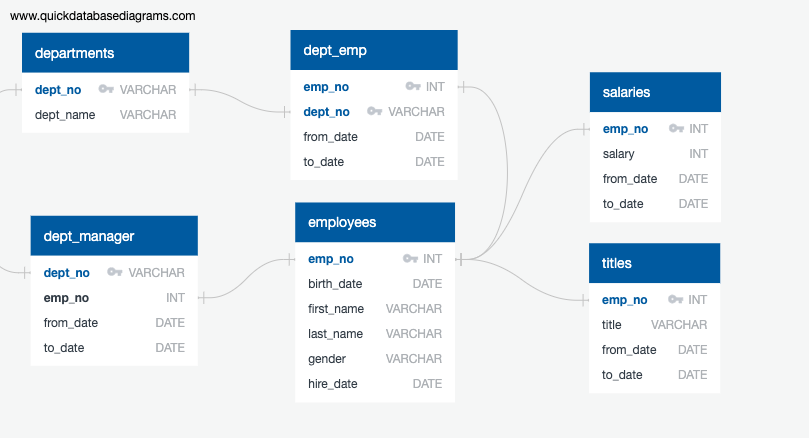
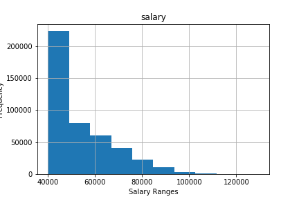
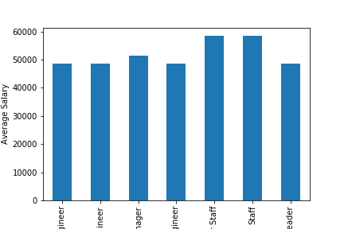

Led a Data Workflow project on employees of a corporation from the 1980s and 1990s using SQL and Python. The database of employees from that period are in six CSV files.

I Designed the tables to hold data in the CSVs, import the CSVs into a PostgresSQL database, and answer questions about the data. In other words, perform the following:

1. Data Modeling
2. Data Engineering
3. Data Analysis
4. Visualization in Python ( Pandas and matplotlib.pyplot)

## Data Modeling

#### ERD development based on CSV data

## Data Engineering

* Table schema were created based on the six CSV files. Data types, primary keys, foreign keys, and other constraints were specified.

* Imported each CSV file into the corresponding SQL table.

## Data Analysis

#### Salary by employee
SELECT  emp.emp_no,
        emp.last_name,
        emp.first_name,
        emp.gender,
        sal.salary
FROM employees as emp
    LEFT JOIN salaries as sal
    ON (emp.emp_no = sal.emp_no)
ORDER BY emp.emp_no;

#### Employees hired in 1986
SELECT first_name, last_name
FROM employees
WHERE hire_date BETWEEN '1986-01-01' AND '1986-12-31';

#### Manager of each department
SELECT  dm.dept_no,
        d.dept_name,
        dm.emp_no,
        e.last_name,
        e.first_name,
        dm.from_date,
        dm.to_date
FROM dept_manager AS dm
    INNER JOIN departments AS d
        ON (dm.dept_no = d.dept_no)
    INNER JOIN employees AS e
        ON (dm.emp_no = e.emp_no);

#### Department of each employee
SELECT  e.emp_no,
        e.last_name,
        e.first_name,
        d.dept_name
FROM employees AS e
    INNER JOIN dept_emp AS de
        ON (e.emp_no = de.emp_no)
    INNER JOIN departments AS d
        ON (de.dept_no = d.dept_no)
ORDER BY e.emp_no;

#### Employees whose first name is "Hercules" and last name begins with "B"
SELECT *
FROM employees
WHERE first_name = 'Hercules'
AND last_name LIKE 'B%';

#### Employees in the Sales department
SELECT  e.emp_no,
        e.last_name,
        e.first_name,
        d.dept_name
FROM employees AS e
    INNER JOIN dept_emp AS de
        ON (e.emp_no = de.emp_no)
    INNER JOIN departments AS d
        ON (de.dept_no = d.dept_no)
WHERE d.dept_name = 'Sales'
ORDER BY e.emp_no;

#### Employees in Sales and Development departments
SELECT  e.emp_no,
        e.last_name,
        e.first_name,
        d.dept_name
FROM employees AS e
    INNER JOIN dept_emp AS de
        ON (e.emp_no = de.emp_no)
    INNER JOIN departments AS d
        ON (de.dept_no = d.dept_no)
WHERE d.dept_name IN ('Sales', 'Development')
ORDER BY e.emp_no;

#### The frequency of employee last names
SELECT last_name, COUNT(last_name)
FROM employees
GROUP BY last_name
ORDER BY COUNT(last_name) DESC;

## Visualizations

Imported the SQL database into Pandas (Python) by using SQLAlchemy. Consult SQLAlchemy documentation for more information. https://docs.sqlalchemy.org/en/13/core/engines.html#postgresql

Create a bar chart of average salary by title.

#### Most common salary ranges for employees

#### Average salary by title

### Observations

## Data Modeling
There are two primary keys of employee number and department number in the employees table and departments table respectively.
Employee number is a foreign key in the titles, salaries, and department employee tables, which links them to the employees table.
Department number is a foreign key in the department manager and department employee tables, which links them to the departments table.

## Data Engineering
There are 300,024 employees in the database for whom a salary record is present.
There were 36,150 employees hired in 1986.
Only 24 employees have been managers of one or more of the nine departments.
There are 331,603 records for employee department assignments, as some employees worked in multiple departments during their tenure.
Only 20 employees have a last name that begins with B and a first name of Hercules.
A total of 52,245 employees have ever been assigned to the sales department.
A total of 137,952 records are present for employees assigned to the sales and/or development departments.
There are 1,638 unique employee last names, with all but one having over 140 occurrences.

## Data Analysis
The vast majority of employees have salaries between $40,000 and $50,000, with a significant decrease in frequency to the next highest range. The frequencies decrease slowly across the remaining salary ranges, with no salaries being greater than $130,000.
Staff and Senior Staff have the highest average salaries, followed by Managers. Technique Leaders, Engineers, Senior Engineers, and Assistant Engineers all have approximately the same average salary, with the difference being no greater than $87.
